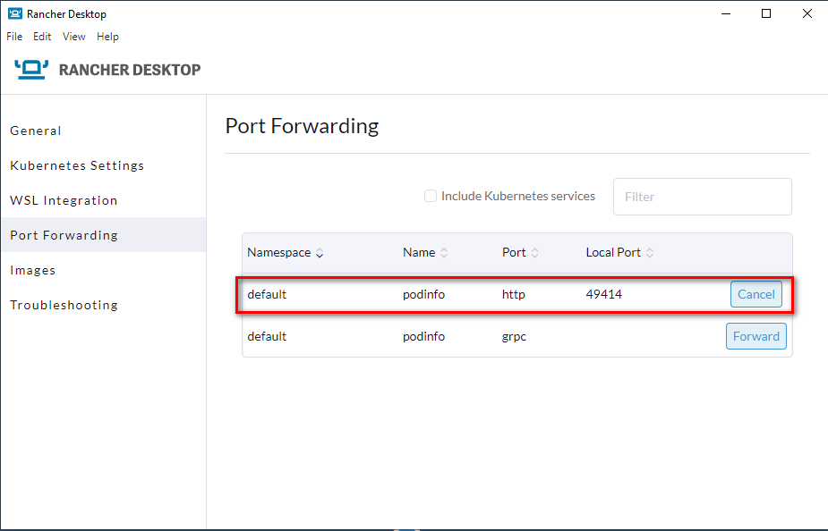

* [Requirements](#requirements)
* [Installation - WINDOWS](#installation---windows)
* [Usage - WINDOWS](#usage---windows)
* [Installation - LINUX](#installation---linux)
* [Usage - LINUX](#usage---linux)
* [Run several projects simultaneously](#run-several-projects-simultaneously)
* [Supported Stacks](#supported-stacks)
* [Additions/Tweaks to JupyerLab](#additionstweaks-to-jupyerlab)
* [Good to know & troubleshooting](#good-to-know--troubleshooting)


# AWK Datalab
* Get your Data Analytics environment up and running in seconds
* Add and remove technology stacks as needed
* Collaborate and share your environment easily even years later - being sure that everything still runs
* Control your docker environment through a Jupyter notebook instead of command line arguments

## Requirements
* WSL setup on your Windows machine (see [ACL Onboarding, setup for WSL](https://github.com/awkgroupag/ITA-ACL-Onboarding/blob/main/General_topics/dev-setup.md#wsl)) for instructions on how to get WSL ready
* Windows: Rancher Desktop installed on your system, e.g. [Rancher Desktop](https://rancherdesktop.io/)
* Linux: Another Kubernetes distribution, e.g. [K3S](https://k3s.io/)
* Code version management like `git` (used below). Since we're using GitHub, try [GitHub Desktop](https://desktop.github.com/) that comes bundled with `git`.

### Test requirements with [Podinfo](https://github.com/stefanprodan/podinfo)
Open a Windows command prompt and enter the following to install Podinfo:
```console
foo@bar:~$ kubectl apply -k github.com/stefanprodan/podinfo/kustomize

service/podinfo created
deployment.apps/podinfo created
horizontalpodautoscaler.autoscaling/podinfo created
```
Check whether the Podinfo Kubernetes pods are running; `STATUS` should be `Running`. You might need to wait a bit.
```console
foo@bar:~$ kubectl get pods -A

NAMESPACE     NAME                                      READY   STATUS    RESTARTS   AGE
kube-system   local-path-provisioner-84bb864455-jtltm   1/1     Running   0          31m
kube-system   coredns-96cc4f57d-2zffw                   1/1     Running   0          31m
kube-system   metrics-server-ff9dbcb6c-f7vlp            1/1     Running   0          31m
default       podinfo-59579c6587-f9bj2                  1/1     Running   0          24m
default       podinfo-59579c6587-h65j9                  1/1     Running   0          24m
```
**Windows only:** To actually connect to the pod you just created, you need to forward a port:
* Right-click on the Rancher Desktop tray icon, then choose `Preferences`
* In the `Port Forwarding` tab, hit the `Forward` button for the entry with name `podinfo` and port `http`. A random local port on your host machine will be forwarded to the corresponding Podinfo service:

* Using a browser, surf to `localhost:<random forwarded port>`, in our case `localhost:49414`

Once your test has been successful, remove Podinfo from Kubernetes:
```console
foo@bar:~$ kubectl delete -k github.com/stefanprodan/podinfo/kustomize

service "podinfo" deleted
deployment.apps "podinfo" deleted
horizontalpodautoscaler.autoscaling "podinfo" deleted
```

## Installation - WINDOWS
### 1. Create the directory structure for your new project
If you publish your source code to GitHub, you will include your datalab and thus your entire infrastructure
* Create a new dedicated directory for your source code on your local machine
* Download this entire datalab's sourcecode:
  1. Hit the green `Code`-button on GitHub, then `Download ZIP`
  2. Unzip the downloaded ZIP-file into the source code folder you just created
  3. **Important**: rename the folder you justed unzipped from `datalab-master` to `datalab`
* Create another dedicated directory for your data - NOT within the source code directory since you don't want to upload your data to the internet

### 2. Set-up environment variables for your new project once
Change the values in the file `./datalab-stacks/environment.env.EXAMPLE`. Save the customized file as a new file `./datalab-stacks/environment.env`.
* `PROJECT_NAME`: name of this project. Will show up in all resource names associated with this project. No spaces or special characters allowed
* `DATALAB_SOURCECODE_DIR`: the new directory you just created above, containing all your source code. Will appear as `/home/jovyan/work` in the Jupyter Notebook
* `DATALAB_DATA_DIR`: your directory containing all data. Will be mounted as `/home/jovyan/data` in the Notebook


### 3. Set-up GitHub repository for backup, version-control & collaboration
1. Create a new **empty** repository (usually a private one, thus visible for AWK employees only) on the [AWK GitHub page](https://github.com/awkgroupag) (the green `New`-button). Note the new URL to your new repo, e.g. https://github.com/awkgroupag/MY-NEW-REPO
2. Open a command prompt and navigate to your source code folder
3. Type (replacing the URL)
```console
foo@bar:~$ git init
# git's default branch name is master, let's change this to GitHub's main
foo@bar:~$ git branch -M main
foo@bar:~$ git remote add origin https://github.com/awkgroupag/MY-NEW-REPO
# Add the entire datalab to your first commit
foo@bar:~$ git add .
foo@bar:~$ git commit -m "initial commit"
# Actually upload the files to GitHub.com
foo@bar:~$ git push --set-upstream origin main
```
4. You should be prompted for your GitHub credentials after the last command above
5. Check [Atlassian's Comparing Workflows](https://www.atlassian.com/git/tutorials/comparing-workflows) to get started with `git`. See the [Git-flow-Workflow](https://www.atlassian.com/git/tutorials/comparing-workflows/gitflow-workflow) to understand collaboration with other team members.
    * Use `git pull` to get the latest changes from GitHub
    * Use `git commit` and `git push` to push your changes to GitHub
    * Work with dedicated new branches for changes, do not work directly with the branch `main`

## Usage - WINDOWS
### 1a. Start a single Jupyter Notebook directly
In your `datalab` directory, just run `run_jupyter_notebook.cmd` directly. JupyterLab will open in Chrome automatically.


### 1b. Start the controlboard if it gets more complicated
* Run `run_controlboard.cmd`.
* Once the controlboard is up, it will be opened within Chrome.
* Just follow the instructions in the notebook `ControlBoard.ipynb` which is opened automatically.

### 2. Do your work
As everything else will be **deleted** when recreating the Jupyter container: Make sure that
* your source code is saved to `/home/jovyan/work`
* your data lives in `/home/jovyan/data`

### 3. Stop and/or remove the containers when done
* You can simply stop all your running notebooks by stopping **Rancher Desktop**. They will all restart once you start Rancher Desktop again.
* Calling `rm_jupyter_notebook.cmd` removes the container, thus resetting everything. Note that the configuration for it will be retained in your `DATALAB_DATA_DIR` (Notbook configuration file and pod deployment specification)
* If you used the controlboard (4b): Be sure to stop any other stacks you might have started from within the controlboard first. Then run `rm_controlboard.cmd`.

## Installation - LINUX
>Note: TODO not sure **Rancher Desktop** exists for Linux .. but you should be able to use [k3s](https://k3s.io/), as this is what is used under the hood of Rancher Desktop.

Just follow the instructions for the Windows installation above and do the following extra step at the end:

### 4. Load environment variables (necessary once e.g. per SSH-session start)
Load the environment variables you just declared for this project.
```bash
cd datalab-stacks
set -a
. environment.env
set +a
```

## Usage - LINUX
### 1a. Start a single Jupyter Notebook directly
>NOTE: TODO .. the script run_jupyter_controlboard.cmd is **NOT** yet rewritten as a Linux shell script. Therefore, this will still use **Docker** and **docker-compose**
* Navigate to the folder `datalab-stacks/jupyter`
* Run `docker-compose up -d`
* Copy the URL of the log output when you enter `docker-compose logs`. The log output will end with something like this:
```
jupyter_1  |     To access the server, open this file in a browser:
jupyter_1  |         file:///home/jovyan/.local/share/jupyter/runtime/jpserver-7-open.html
jupyter_1  |     Or copy and paste one of these URLs:
jupyter_1  |         http://bc1a7b9a832a:8888/lab?token=d5d6cb3f75aeee90cad00959ce588c8050da53900bc948b1
jupyter_1  |      or http://127.0.0.1:8888/lab?token=d5d6cb3f75aeee90cad00959ce588c8050da53900bc948b1
```
In this case, use `http://127.0.0.1:8888/lab?token=d5d6cb3f75aeee90cad00959ce588c8050da53900bc948b1` to access Jupyter.
* **WARNING**: if you changed Jupyter's port `DATALAB_JUPYTER_PORT`, adjust port `8888` accordingly!

### 1b. Start the controlboard if it gets more complicated
>NOTE: TODO .. this is work in progress and will not yet work with **Rancher Desktop**, but still use **Docker** and **docker-compose**
* Navigate to the root folder of this repository.
* Run `docker-compose -f controlboard.yml up -d`
* Copy the URL of the log output when you enter `docker-compose -f controlboard.yml logs`, see 3a. above.
* Replace port `8888` with your `DATALAB_CONTROLBOARD_PORT`, most likely `12334`
* Once you have opened JupyterLab using your browser, open the notebook `datalab-stacks/ControlBoard.ipynb`


## Run several projects simultaneously
Easily run several projects at the same time. Make sure that you choose different project-names in `./datalab-stacks/environment.env` and also set different, **unique** values for all variables of services you plan to use simultaneously.


## Supported Stacks
Run the following stacks on your local machine or remote server:
* ["Vanilla" Jupyterlab](https://jupyterlab.readthedocs.io/en/stable/)
>NOTE: TODO .. the script run_jupyter_controlboard.cmd is **NOT** yet rewritten as a Linux shell script. Therefore, this will still use **Docker** and **docker-compose**
* [PostgreSQL Database](https://www.postgresql.org/)
* [Neo4j](https://neo4j.com/)
* [MySQL Database](https://www.mysql.com/)
* [Elastic Stack (formerly ELK-Stack)](https://www.elastic.co/de/products/)

## Additions/Tweaks to JupyerLab

The following packages are installed on-top of the [jupyter/datascience-notebook](https://jupyter-docker-stacks.readthedocs.io/en/latest/using/selecting.html).

Automation
* [Featuretools](https://featuretools.alteryx.com/en/stable/), an open source python framework for automated feature engineering
* [h2o AutoML](http://docs.h2o.ai/h2o/latest-stable/h2o-py/docs/index.html): Automatic machine learning
* [TPOT](http://epistasislab.github.io/tpot/): optimize machine learning pipelines using genetic programming
* [auto-sklearn](https://automl.github.io/auto-sklearn/master/index.html), automated machine learning toolkit and a drop-in replacement for a scikit-learn estimator

Explainable AI
* [SHAP (SHapley Additive exPlanations)](https://github.com/slundberg/shap): game theoretic approach to explain the output of any machine learning model
* [Lime](https://github.com/marcotcr/lime): Explaining the predictions of any machine learning classifier
* [ELI5](https://eli5.readthedocs.io/en/latest/overview.html): debug machine learning classifiers and explain their predictions

NLP
* [spaCy](https://spacy.io/): Industrial-strength NLP
* [Natural Language Toolkit (NLTK)](https://www.nltk.org/): leading platform for building Python programs to work with human language data

Visualizations
* [Plotly](https://plotly.com/python/): Graphing library for interactive, publication-quality graphs
* [Altair](https://altair-viz.github.io/): Declarative Visualization in Python
* [Wordcloud](https://github.com/amueller/word_cloud): fill any space with a word cloud

Frontend and apps
* [Streamlit](https://docs.streamlit.io/en/stable/): The fastest way to build and share data apps

Database stuff
* [sqlalchemy-utils](https://sqlalchemy-utils.readthedocs.io/en/latest/)
* [sqlalchemy_schemadisplay](https://github.com/fschulze/sqlalchemy_schemadisplay)
* [psycopg2 PostgreSQL Connector](https://www.psycopg.org/docs/)
* [mysql-connector-python MySQL Connector](https://dev.mysql.com/doc/connector-python/en/)

Tools
* [Pandas Profiling](https://pandas-profiling.github.io/pandas-profiling/docs/master/rtd/): Create profiling reports from pandas DataFrame objects
* [lxml](https://lxml.de/): secure and fast XML and HTML with Python

JupyterLab plugins
* [jupyterlab-git](https://github.com/jupyterlab/jupyterlab-git): Version control using Git within Jupyter
* [Language Server Protocol integration](https://github.com/krassowski/jupyterlab-lsp): Coding assistance for JupyterLab - code navigation + hover suggestions + linters + autocompletion + rename
* [jupyter-resource-usage](https://github.com/jupyter-server/jupyter-resource-usage): Monitor RAM and CPU usage within a Jupyter notebook


## Good to know & troubleshooting
>NOTE: TODO .. this is work in progress and is not yet rewritten for **Rancher Desktop**
* Docker containers such as this controlboard or the different stacks will keep on running forever, even if you restart your machine. So remember [to stop them](#5-stop-andor-remove-the-containers-when-done).
* Jupyter will not start; container restarts all the time
  - Your Docker images might take up a lot of space. Type `docker image ls` to view your images
  - `docker image rm <IMAGE>` deletes a specific image, `docker image prune` deletes all unused images
